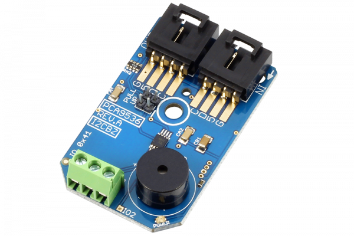

# PCA9536

The PCA9536 is a general purpose 4-Channel digital I/O controller. In this design, we dedicated the last GPIO (GPIO.3) to a buzzer for alarm notification applications. The remaining three GPIO pins are available for user applications. The address of the PCA9536 is fixed at 0x64, so only one of these devices may be attached to a single I2C port.
This Device is available from www.ncd.io 

[SKU: PCA9536_I2CS]

(https://store.ncd.io/product/pca9536-i2c-digital-3-channel-input-output-with-buzzer-i2c-mini-module/)
This Sample code can be used with Arduino.

Hardware needed to interface PCA9536 sensor with Arduino

1. <a href="https://store.ncd.io/product/i2c-shield-for-arduino-nano/">Arduino Nano</a>

2. <a href="https://store.ncd.io/product/i2c-shield-for-arduino-micro-with-i2c-expansion-port/">Arduino Micro</a>

3. <a href="https://store.ncd.io/product/i2c-shield-for-arduino-uno/">Arduino uno</a>

4. <a href="https://store.ncd.io/product/dual-i2c-shield-for-arduino-due-with-modular-communications-interface/">Arduino Due</a>

5. <a href="https://store.ncd.io/product/pca9536-i2c-digital-3-channel-input-output-with-buzzer-i2c-mini-module/">PCA9536 3Channel Input Output With Buzzer</a>

6. <a href="https://store.ncd.io/product/i%C2%B2c-cable/">I2C Cable</a>

PCA9536:

The PCA9536 is a general purpose 4-Channel digital I/O controller. In this design, we dedicated the last GPIO (GPIO.3) to a buzzer for alarm notification applications. The remaining three GPIO pins are available for user applications. The address of the PCA9536 is fixed at 0x64, so only one of these devices may be attached to a single I2C port.

Applications:

• Battery power applications.

How to Use the PCA9536 Arduino Library

The PCA9536 has a number of settings, which can be configured based on user requirements.
          
1.Address calling:The following command is used to call the PCA9536 sensor to begin the transmission.

            pca.getAddr_PCA9536_BZ(PCA9536_BZ_DEFAULT_ADDRESS);           // 0x41
            
 2.Reset:The following command is used to reset the module.
 
            pca.Reset();
            
3.Sensor setup:The following command is used to setup the sensor.

            pca.setPinMode(PCA9536_BZ_OUTPUT_PIN3, PCA9536_BZ_MODE_OUTPUT);
